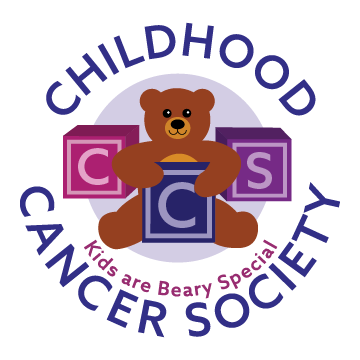

# Childhood Cancer Society

Childhood Cancer Society (CCS) is a volunteer-run 501(c)(3) non-profit dedicated to helping families who are struggling with childhood cancer. From financial support to providing gifts/wish grants, our efforts support families battling pediatric cancer to maintain a mindset conducive to healing.
